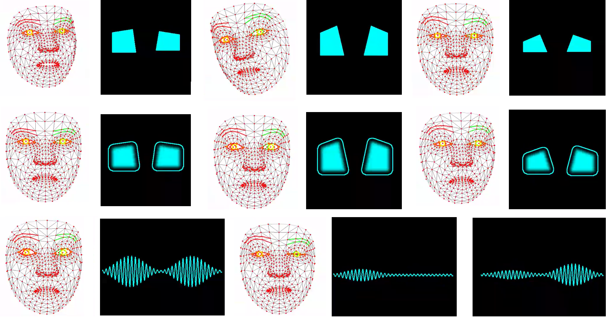
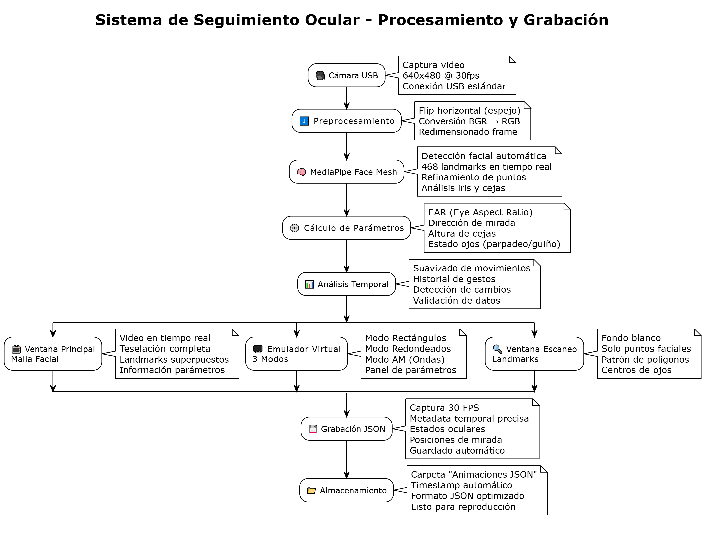

# Virtual Eye Emulator



**Sistema de emulación virtual de seguimiento ocular en tiempo real con MediaPipe para robótica interactiva**

**Autor:** Alejandro Aguirre Díaz

**Descripción**
Sistema de emulación virtual de seguimiento ocular en tiempo real diseñado para robótica interactiva. El proyecto captura movimientos oculares y expresiones faciales mediante MediaPipe Face Mesh y genera una emulación visual adaptable a pantallas de robots, con modos gráficos pensados para facilitar interacción natural y expresiva.

**Última modificación:** Miércoles 3 de diciembre de 2025

---

## Contenido
- Planteamiento del problema
- Problemas identificados
- Pregunta de investigación
- Justificación (relevancia, impacto, viabilidad)
- Objetivos (general y específicos)
- Marco teórico (resumido)
- Metodología y fases de desarrollo
- Programas y estructura del repositorio
- Análisis del código y recomendaciones
- Cómo probar rápido
- Glosario técnico

> Navega usando los encabezados para localizar secciones rápidamente.

---

## 1. Planteamiento del problema
En el campo de la robótica interactiva moderna, existe una necesidad crítica de desarrollar sistemas que permitan a los robots establecer comunicación más natural y expresiva con los usuarios humanos a través de expresiones oculares realistas.

## 2. Problemas identificados
- **Falta de expresividad emocional** en robots sociales e interactivos
- **Limitaciones técnicas** en sistemas de seguimiento ocular de bajo costo para aplicaciones robóticas
- **Complejidad** de implementación de sistemas de visión artificial en dispositivos embebidos
- **Ausencia de herramientas accesibles** para capturar y reproducir gestos oculares naturales en tiempo real

## 3. Pregunta de investigación
¿Cómo desarrollar un sistema eficiente y económico de seguimiento y emulación ocular que permita a robots interactivos reproducir expresiones faciales naturales para mejorar significativamente la calidad de la comunicación humano-robot?

## 4. Justificación

### 4.1 Relevancia Tecnológica
- **Robótica social:** los robots con expresiones oculares naturales mejoran la percepción de "vida" y naturalidad en la interacción.
- **Interfaces humano-robot:** sistemas de seguimiento ocular crean conexiones más intuitivas y empáticas.
- **Entretenimiento robótico:** robots mascotas y compañeros con expresiones realistas.

### 4.2 Impacto en Robótica Interactiva
- **Innovación en comunicación no verbal:** avance significativo en la humanización de interfaces robóticas.
- **Accesibilidad económica:** solución de bajo costo (< $100 USD) comparada con sistemas comerciales (~$15,000+).
- **Escalabilidad:** arquitectura modular aplicable a diferentes tipos de robots interactivos.

### 4.3 Viabilidad del Proyecto
- **Mercado en crecimiento:** mercado de robótica social proyectado en $17.4 billones para 2030.
- **Aplicaciones inmediatas:** robots educativos, mascotas robóticas, asistentes domésticos.
- **Transferencia tecnológica:** base para desarrollos futuros en IA emocional y robótica avanzada.

## 5. Objetivos

### 5.1 Objetivo General
Desarrollar un sistema integral de seguimiento y emulación ocular en tiempo real que utilice técnicas avanzadas de visión artificial para capturar, procesar y reproducir movimientos oculares naturales en dispositivos robóticos de bajo costo, enfocado específicamente en aplicaciones de robótica interactiva.

### 5.2 Objetivos Específicos
1. Implementar detección facial avanzada utilizando **MediaPipe Face Mesh** para identificar 468 landmarks faciales con precisión superior al 95%.
2. Desarrollar algoritmos de seguimiento ocular que detecten **parpadeos, guiños, dirección de mirada y movimiento de cejas** con latencia inferior a 50 ms.
3. Crear sistema modular de emulación visual con **tres modos** de visualización (rectángulos, redondeados, ondas AM) adaptables a diferentes tipos de pantallas robóticas.
4. Diseñar protocolo eficiente de **grabación/reproducción** para capturar gestos oculares y reproducirlos en dispositivos ESP32 con pantallas OLED.
5. Validar la integración hardware-software mediante **comunicación USB optimizada** entre PC y microcontroladores.
6. Optimizar el rendimiento del sistema para funcionamiento en tiempo real a **25+ FPS** en hardware de bajo costo.

## 6. Marco teórico (resumido)

### 6.1 Visión Artificial y Detección Facial
MediaPipe es un framework desarrollado por Google que utiliza redes neuronales convolucionales (CNN) pre-entrenadas para detectar landmarks faciales en tiempo real. El modelo Face Mesh identifica 468 puntos específicos en el espacio tridimensional, permitiendo análisis detallado de expresiones faciales y movimientos oculares (Lugaresi et al., 2019).

### 6.2 Eye Aspect Ratio (EAR)
El EAR es una métrica fundamental desarrollada por Soukupová & Čech (2016) para medir la apertura ocular. Se define a partir de seis landmarks del ojo (p1..p6) y su valor típico permite distinguir entre ojo abierto y cerrado. Valores de referencia: **EAR > 0.25** (ojo abierto), **EAR < 0.20** (ojo cerrado). En implementaciones reales es recomendable usar un pequeño **epsilon** para evitar divisiones por cero.

### 6.3 Robótica Interactiva y Comunicación No Verbal
La robótica interactiva se enfoca en crear robots capaces de comunicarse naturalmente con humanos. Los ojos son fundamentales en la comunicación no verbal, transmitiendo información emocional y de atención.

### 6.4 Sistemas Embebidos para Robótica
Las pantallas **OLED SH1106 (128x64)** ofrecen características ideales para aplicaciones robóticas: alta velocidad de refresco (>60Hz), bajo consumo energético (<50mA), excelente contraste y tamaño compacto.

### 6.5 Representación de Señales Oculares
La modulación de amplitud (AM) permite representar patrones de apertura/cierre ocular como ondas moduladas, facilitando análisis de frecuencia de parpadeo y detección de patrones de atención en robots interactivos.

## 7. Metodología

### 7.1 Enfoque de Desarrollo
- **Metodología:** Prototipado evolutivo con validación iterativa en aplicaciones robóticas.
- **Framework:** Desarrollo ágil con sprints de 1 semana enfocados en funcionalidades específicas.
- **Testing:** Pruebas continuas con escenarios de interacción humano-robot.

### 7.2 Arquitectura del Sistema



### 7.3 Fases de Desarrollo
- **Fase 1 — Fundamentos de Detección (Semana 1)**
	- Implementación MediaPipe Face Mesh para detección facial.
	- Desarrollo de algoritmos EAR para detección precisa de parpadeos.
	- Sistema básico de tracking de dirección de mirada.

- **Fase 2 — Emulación Visual Avanzada (Semana 2)**
	- Desarrollo de 3 modos de emulación visual diferenciados.
	- Interfaz de usuario con controles en tiempo real.
	- Optimización de rendimiento gráfico para aplicaciones robóticas.

- **Fase 3 — Integración y Grabación (Semana 3)**
	- Sistema de captura de gestos a 30 FPS.
	- Formato JSON optimizado para dispositivos ESP32.

### 7.4 Métricas de Evaluación
- Precisión de detección facial: **>95%** en condiciones robóticas típicas.
- Latencia total del sistema: **<50 ms** desde captura hasta visualización.
- FPS mínimo sostenido: **25** frames por segundo.
- Tasa de error en parpadeos: **<2%** en detección automática.
- Eficiencia energética: **<100 mA** consumo total del sistema.

## 8. Programas y estructura del repositorio

Archivos principales incluidos en este repositorio:
- `Face_Detector.py`: Versión simplificada para debugging. Visualiza landmarks y muestra ventanas de inspección rápida.
- `Virtual_Eye_Emulator.py`: Implementación completa del emulador con detección avanzada, modos de visualización y sistema de grabación.

### 8.1 Características clave implementadas
- Detección facial robusta: MediaPipe con soporte para 468 landmarks.
- Algoritmo EAR mejorado: Detección de parpadeos, guiños y estados oculares.
- Sistema de tracking del iris para estimar dirección de mirada.
- Emulación multi-modal: modos **Rectángulos**, **Redondeados** y **AM**.
- Grabación optimizada: Captura de frames y metadata en JSON/MP4 para reproducción y transferencia a microcontroladores.

## 9. Análisis del código
Esta sección compara y sintetiza los tres módulos principales del repositorio —`Face_Detector.py`, `Virtual_Eye_Emulator.py` y `Virtual_Eye_Emulator_2.py`—, y propone acciones priorizadas para mejorar robustez, mantenimiento y facilidad de prueba.

### 9.1 Síntesis rápida por fichero
- `Face_Detector.py` (herramienta de debugging): código ligero y fácil de ejecutar. Su objetivo es visualizar todos los landmarks y ofrecer una ventana de «escaneo» para calibración. Ventajas: simple, rápido, útil para pruebas manuales. Riesgos: usa índices de landmarks que pueden diferir de la versión productiva (consistencia), y no incluye protecciones numéricas ni logging detallado.
- `Virtual_Eye_Emulator.py` (implementación completa): integra MediaPipe Face Mesh, cálculo EAR, estimación de iris, detección de parpadeos/guiños, varios modos de visualización y grabación JSON/MP4. Es la versión base orientada a producción, pero contiene áreas mejorables en manejo de errores, validación de tamaños y parametrización.
- `Virtual_Eye_Emulator_2.py` (versión avanzada/tunable): refina umbrales por defecto, reduce history_size para mayor responsividad, incorpora modos gráficos y un sistema de grabación más completo. Aporta mayor detalle funcional, pero también repite muchas estructuras (índices, validaciones) que convendría unificar.	

### 9.2 Face_Detector.py

- **Propósito y alcance:** Herramienta ligera y orientada a debugging para inspeccionar landmarks de MediaPipe en tiempo real. Sirve para calibración visual rápida y para comprobar que la detección de puntos faciales está operativa en la cámara del desarrollador.

- **Estructura principal:** contiene la clase `SimpleEyeTracker` con método `run()` que:
	- Inicializa `mp.solutions.face_mesh.FaceMesh(refine_landmarks=False)` para menor coste.
	- Captura frames de la cámara (flip espejo), procesa landmarks y dibuja el mesh en el frame principal.
	- Genera una ventana `ESCANEO FACIAL` donde se pintan todos los landmarks como puntos rojos y se destacan ojos/contorno.
	- Calcula centros de ojo promedio (promedio de los puntos del contorno) y pinta una emulación simple en `virtual_frame` (dos círculos que simulan ojos).

- **Funciones clave:** dibujo de landmarks, cálculo simple de centro de ojo (media aritmética de puntos), emulación visual inmediata en una ventana separada.

- **Salidas/artefactos:** ventanas OpenCV en pantalla: `Simple Eye Tracker - Principal`, `Simple Eye Tracker - Virtual`, `ESCANEO FACIAL - Landmarks en Tiempo Real`.

### 9.3 Virtual_Eye_Emulator.py

- **Propósito y alcance:** Implementación completa orientada a emulación visual estable y grabación. Integra cálculo de EAR, estimación del iris, detección de parpadeos/guiños, suavizado temporal y modos de visualización pensados para pantallas robóticas.

- **Estructura principal y componentes:**
	- Clase `EyeTracker` que inicializa MediaPipe `FaceMesh(refine_landmarks=True)` y utilidades de dibujo.
	- Listas de índices para contornos oculares, iris y cejas (ej.: `LEFT_EYE_LANDMARKS`, `RIGHT_IRIS`, etc.).
	- Métodos principales: `calculate_eye_aspect_ratio`, `get_eye_center`, `get_iris_center`, `get_eyebrow_height`, `detect_eye_state`, `detect_eye_movement`, `draw_virtual_eyes`, `start_recording`, `stop_recording`, `capture_frame_for_recording`, `process_frame`, `run_virtual_eye_tracker`.

- **Comportamiento y parámetros por defecto:**
	- Umbrales: `blink_threshold ≈ 0.20`, `wink_threshold ≈ 0.18`.
	- Suavizado: `history_size = 3`, `consecutive_frames = 2` para detección responsiva.
	- Modos gráficos: `RECTANGULOS`, `REDONDEADOS`, `AM`.

- **Grabación y formatos:** guarda metadata en `Animaciones JSON` y vídeos en `AnimacionMP4` usando `cv2.VideoWriter` y un esquema JSON por frame para reproducción en sistemas embebidos (ESP32 u otros).


### 9.4 Virtual_Eye_Emulator_2.py

- **Propósito y alcance:** Versión avanzada y afinada del emulador que mantiene la interfaz y funcionalidades de la versión principal, pero con parámetros por defecto más agresivos (mayor responsividad), más lógica AM para emulación y gestión de grabación más completa.

- **Diferencias relevantes respecto a la versión base:**
	- Umbrales y timing afinados (`blink_threshold`, `wink_threshold`, `history_size`) para sensibilidad aumentada.
	- Estado AM (`am_openness`, `am_phase`, `AM_FRAME_INTERVAL`) y funciones gráficas adicionales: `draw_am_wave`, `draw_rounded_rectangle_with_cut`, `draw_diagonal_rectangle`.
	- Manejo extendido de grabación: control de `frame_interval`, `max_recording_time`, buffers para frames y metadata, y lógica para iniciar/detener guardado de `.json` y `.mp4`.

- **Puntos fuertes:**
	- Mayor expresividad visual (AM y recortes diagonales/redondeados) y parámetros listos para pruebas en pantallas embebidas.
	- Mejor preparación de artefactos para reproducción (JSON/MP4) y estructura de carpetas ya automatizada.


Estas tres descripciones completan la visión operativa del proyecto y orientan las próximas tareas de refactorización y endurecimiento del código.
## 10. Cómo probar rápido (entorno de desarrollo)

**Requisitos (recomendados):** Python 3.10+, OpenCV, MediaPipe, NumPy, SciPy

**Instalación rápida:**
```bash
python3 -m pip install opencv-python mediapipe numpy scipy
```

**Ejecutar la versión simple (debugging):**
```bash
python3 Face_Detector.py
```

**Ejecutar el emulador completo:**
```bash
python3 Virtual_Eye_Emulator.py
```

**Licencia:** Ver archivo `LICENSE` en el repositorio.

---

## 11. Glosario técnico
- **MediaPipe:** Framework de Google para procesamiento de señales y visión por computadora en tiempo real; incluye modelos preentrenados como Face Mesh.
- **Face Mesh:** Modelo de MediaPipe que detecta hasta 468 landmarks faciales en 3D para análisis detallado de expresiones y movimientos oculares.
- **Landmark (punto de referencia):** Punto 2D/3D detectado en la cara (p. ej. comisura del ojo, centro del iris) usado para cálculos geométricos.
- **Eye Aspect Ratio (EAR):** Métrica que cuantifica la apertura del ojo usando seis landmarks; típica fórmula: EAR = (‖p2-p6‖ + ‖p3-p5‖) / (2·‖p1-p4‖).
- **Iris center (centro del iris):** Coordenada estimada del centro del iris, usada para inferir dirección de la mirada.
- **Parpadeo (Blink):** Cierre breve y completo del párpado detectado por caída del EAR por debajo de un umbral.
- **Guiño (Wink):** Parpadeo unilateral — se detecta cuando sólo un ojo cruza el umbral de EAR.
- **FPS (Frames Per Second):** Número de imágenes procesadas por segundo; indicador clave de rendimiento en tiempo real.
- **Latencia:** Tiempo transcurrido desde la captura del frame hasta la visualización o respuesta; objetivo del proyecto <50 ms.
- **AM (Modulación de Amplitud):** Técnica para representar variaciones de apertura ocular como una onda modulada útil para análisis temporal.
- **OLED SH1106:** Controlador/pantalla OLED pequeña (p. ej. 128x64) utilizada en dispositivos embebidos para visualización robótica.
- **ESP32:** Microcontrolador de bajo costo con conectividad Wi‑Fi/Bluetooth, habitual en proyectos embebidos y control de pantallas OLED.
- **OpenCV (`cv2`):** Biblioteca de visión por computadora usada para captura de vídeo, transformaciones y dibujo sobre frames.
- **NumPy:** Biblioteca para cálculo numérico en Python, utilizada para manipular matrices de imagen y vectores de coordenadas.
- **SciPy:** Biblioteca científica de Python; en este proyecto se utiliza para cálculos geométricos (p. ej. distancia euclidiana).
- **JSON:** Formato de intercambio de datos usado para almacenar metadatos y grabaciones de gestos oculares para reproducción en microcontroladores.
- **`cv2.VideoWriter`:** Clase de OpenCV usada para escribir secuencias de vídeo (MP4/AVI) desde buffers de frames.
- **Refinement (refine_landmarks):** Parámetro de MediaPipe que activa modelos de mayor precisión para ojos/iris, con coste computacional adicional.
- **Landmark indices:** Índices numéricos que identifican cada landmark en la malla facial; deben mantenerse consistentes entre módulos.
- **Epsilon (ε):** Pequeño valor añadido en divisiones (p. ej. cálculo EAR) para evitar división por cero y estabilizar resultados.
- **Smoothing (suavizado):** Filtro temporal aplicado a posiciones de mirada/parpadeo para reducir ruido y evitar oscilaciones rápidas.

## 12. Videos de funcionamiento

- TikTok — [Ver video de funcionamiento en TikTok](https://www.tiktok.com/@fiunva_/video/7579718908551220492)
- Instagram (Reel) — [Ver video de funcionamiento en Instagram](https://www.instagram.com/p/DR0DPTjjPKV/)


